# Whatsapp Message Bot For Personal Use
 A whatsapp bot written in python to help send scheduled messages to a group or phone number.
 
# Content Table 
- [Requirements](https://github.com/bestcolour/Python-Whatsappbot#requirements)
- [How to setup](https://github.com/bestcolour/Python-Whatsappbot#how-to-setup)
- [How to use bot (Whatsapp)](https://github.com/bestcolour/Python-Whatsappbot#interact-through-whatsapp)
  - [Send](https://github.com/bestcolour/Python-Whatsappbot#send-command)
    - [Keywords](https://github.com/bestcolour/Python-Whatsappbot#keywords)
    - ["at"](https://github.com/bestcolour/Python-Whatsappbot#at-keyword)
    - ["on"](https://github.com/bestcolour/Python-Whatsappbot#on-keyword)
    - ["every"](https://github.com/bestcolour/Python-Whatsappbot#every-keyword)
  - [Remove](https://github.com/bestcolour/Python-Whatsappbot#remove-command)
  - [List](https://github.com/bestcolour/Python-Whatsappbot#list-command)
- [How to use bot (Console)](https://github.com/bestcolour/Python-Whatsappbot#interact-through-console)
  - [Send](https://github.com/bestcolour/Python-Whatsappbot#send-console-command)
  - [Remove](https://github.com/bestcolour/Python-Whatsappbot/blob/main/README.md#remove-console-command)
  - [List](https://github.com/bestcolour/Python-Whatsappbot/blob/main/README.md#list-console-command)
  - [Save](https://github.com/bestcolour/Python-Whatsappbot/blob/main/README.md#save-console-command)
  - [Settings](https://github.com/bestcolour/Python-Whatsappbot/blob/main/README.md#settings-console-command)
    - [Timezone](https://github.com/bestcolour/Python-Whatsappbot#time-zone---console-settings)
    - [Group Chat Search Pause](https://github.com/bestcolour/Python-Whatsappbot#group-search-pause---console-settings)
    - [Conversation Input Pause](https://github.com/bestcolour/Python-Whatsappbot#convo-input-pause---console-settings)
    - [Message New Number Pause](https://github.com/bestcolour/Python-Whatsappbot#message-new-number-pause---console-settings)
    - [Auto Save Frequency](https://github.com/bestcolour/Python-Whatsappbot#auto-save-frequency---console-settings)
    - [Save When A Command Is Done](https://github.com/bestcolour/Python-Whatsappbot#save-when-a-command-is-complete---console-settings)
    - [Admin Numbers](https://github.com/bestcolour/Python-Whatsappbot#admin-numbers---console-settings)
    - [Max Tries Before Auto Removal](https://github.com/bestcolour/Python-Whatsappbot#auto-remove-tries---console-settings)
    - [Command Identifier](https://github.com/bestcolour/Python-Whatsappbot#command-identifier---console-settings)
 
# Requirements
- Firefox browser installed on the device you are going to let the bot run on
- A phone number with a Whatsapp account 


# How to setup
1. Download the 'build.zip' file from the release [page](https://github.com/bestcolour/Python-Whatsappbot/releases/tag/future-unknown-release)
<br/>

<br/>
2. Extract the files and go to dist > main > main.exe and open the exe, feel free to create a shortcut for this.
<br/>

<br/>
3. Once opened, you will see a console pop up. Give it a few seconds to open whatsapp web on the Firefox browser.
<br/>

<br/>
4. Scan the QR code on your phone tied to your whatsapp account.
<br/>

<br/>
5. Wait for the whatsapp web to finish loading before pressing "Enter" on the console
<br/>


<br/>
<br/>
<br/>

# How to use the bot

There will be two ways to interact with the bot. 
- Through the whatsapp group that the bot's number is in.
- Through the console that was opened when you clicked on main.exe

# Interact through Whatsapp
Now, to interact with the bot, you must first add it's number into a group chat of yours.
Once added, type '~help' to see a list of commands that the bot can perform.
<br/>


<br/>
<br/>

# Send Command
To use the send command, simply type '~send' and 'msg:<your message here>'. This will send a message to the current groupchat the bot is in.
<br/>


## Keywords
The command consists of keywords. By adding keywords, you could use to change the way a message is sent.
<br/> 
<br/> 
For example, let's say you want a message to be sent to remind the group chat that at 10pm tomorrow, you could type:
```
~send at 10pm 28/2/23 msg:Let's play dota now
```
or
```
~send 280223 at 10pm  msg:Let's play dota now
```
<br/> 
Keywords are interchangeable in position except for '~send' and 'msg:'. They must be at the front and end respectively.

### "at" keyword
"at" tells the bot what time to send the message.


```
at <time>

For example:
at 11.30pm
at 2359
at 8am

If "at" is not used, the time will be set to the current time
```

### "on" keyword
The "on" keyword tells the bot which date to send the message on.


```
on <date>

For example:
on 11/11/2023
on 11/11/23
on 111123

If "on" is not used, the date will be set to the current day
```

### "every" keyword
The "every" keyword is used to tell the bot to repeatedly send the message at a fixed interval.

```
every <interval>

For example:
every 1m (every 1 minute)
every 1h (every 1 hour)
every 1d (every 1 day)
every 1m 1h (every 1 minute and 1 hr)
every 1m 1h 1d (every 1 minute 1 hr and 1 day)

If "every" is not used then there will be not repeated sending of message
```

# Remove Command
The "~remove" command is used to remove any pending commands that you previously had told the bot to do.
 <br/>
 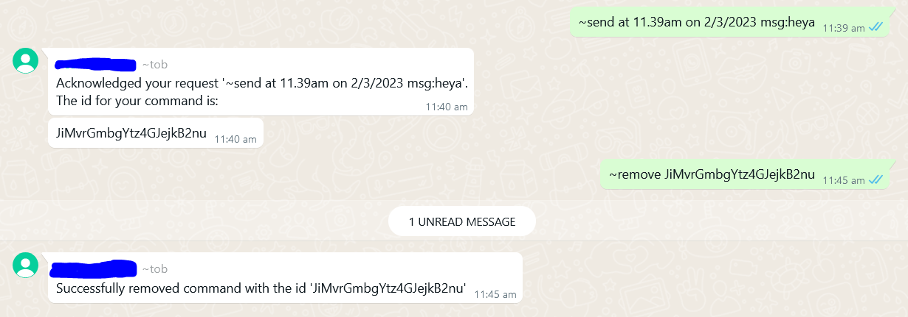
 <br/>
 <br/>
 Every you use the "~send" command, an ID will be returned to you. This ID is used to remove that pending command if the need ever rises.
 
 
 # List Command
 The "~list"  command shows all the pending commands, including their ids, in the group chat.
 <br/>
 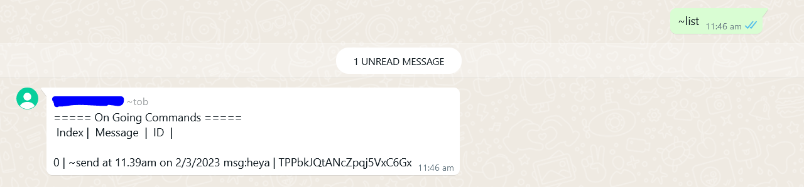
 <br/>
 
 
 # Interact through Console
 Now you can also interact with the bot through the console to use more features, simply type 'help' to get started.
 <br/>
 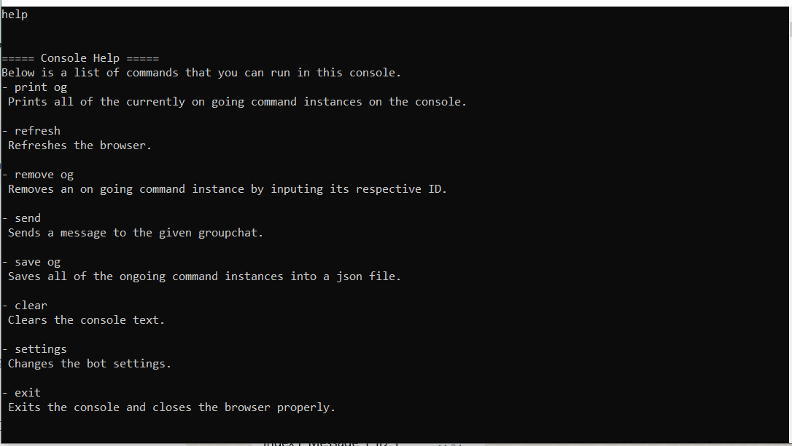
 <br/>

 # Send Console Command
 Sending in the console is a lot different from that on whatsapp. You could choose who/where to send the message to.
 <br/>
 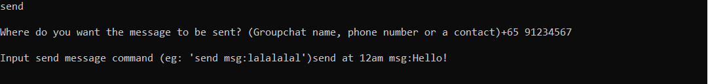
 <br/>
 <br/>
 
 The possible inputs for 'Where do you want the message to be sent?':
 ``` 
 - <phone number>
 - <name of group chat>
 - <contact name> 
 
 For example,
 - +6591234567
 - FamilyChat
 - Dad (Note: the bot is must have the contact added as the same name as the given input)
 
 ```
 <br/> 
 <br/>
 
 ```
 send at 11pm on 12/2/2024 msg:Happy birthday!
 ```
 Once you decided who you want to send to, simply type as if you are typing in whatsapp web
 
 
 # Remove Console Command
 This is the the '~remove' command equivalent from whatsapp web.
 <br/>
 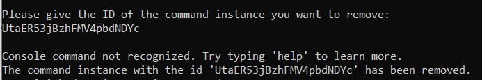
 <br/>
 Similar to "~remove", just give the ID of the command you want to remove and it will be done.
 
 
 # List Console Command
 This is the the '~list' command equivalent from whatsapp web. Simply type "print og" to see all of the pending commands from all chats.
 <br/>
 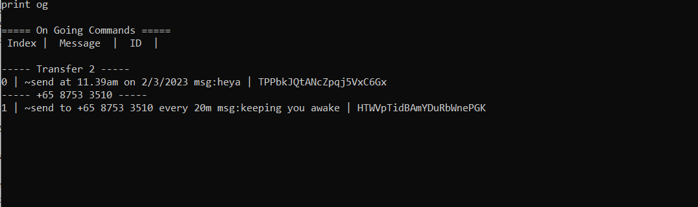
 <br/>

 # Save Console Command
 When 'save og' is called, every pending command from every chat will be saved into a file called "data.json".
 <br/>
 
 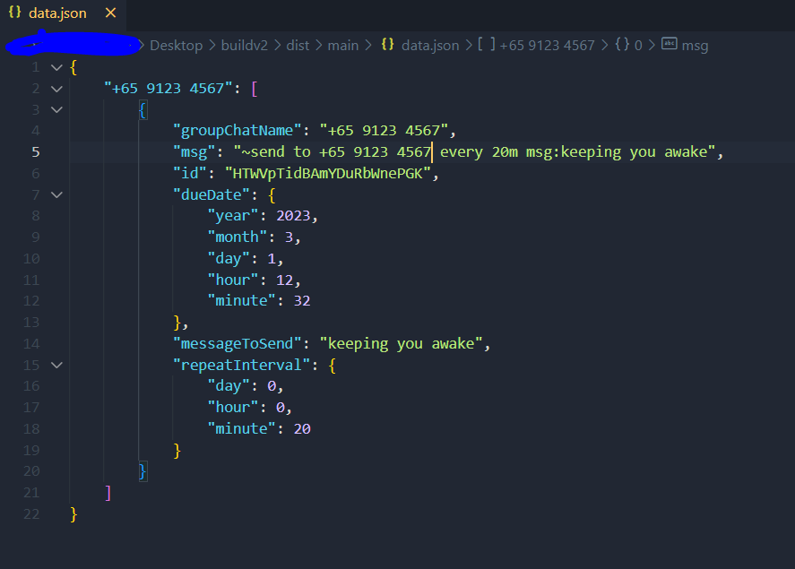
 <br/>
 This data.json will be read by the bot and loaded into it everytime the exe is opened in order to allow the pending commands to persist.
 
 # Settings Console Command
 There are various settings which could be changed for the bot.
 <br/>
 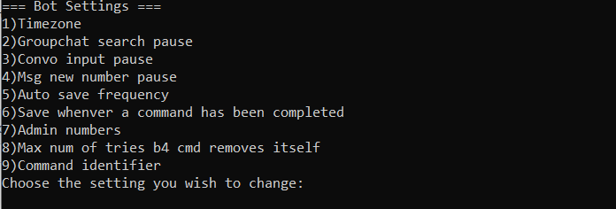
 <br/>
 <br/>
## Time Zone - Console Settings
For the full list of a available timezones, click [here](https://gist.github.com/heyalexej/8bf688fd67d7199be4a1682b3eec7568)
<br/>
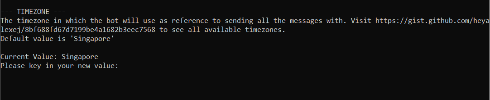
<br/>

## Group Search Pause - Console Settings
This is the duration (in seconds) that the bot waits for while searching for the group chat to select. If your device is slow, it would be better to increase this value.
<br/>
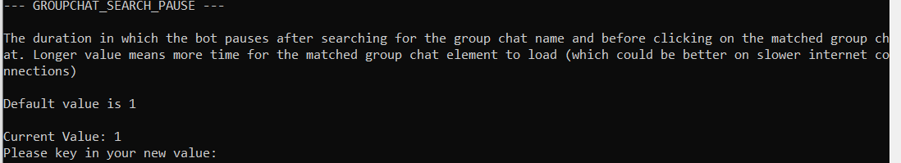


## Convo Input Pause - Console Settings
This is the duration (in seconds) that the bot waits before typing the message to send to the chat. A higher value is better for longer messages as it will allow the long text to be properly loaded into the conversation input box.
<br/>
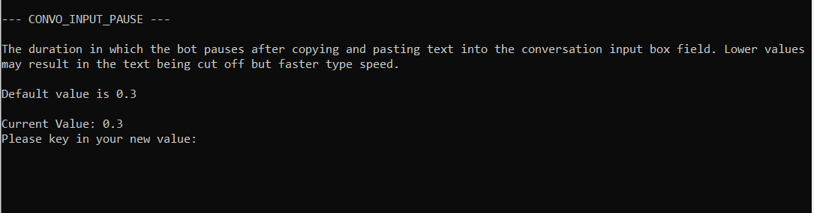


## Message New Number Pause - Console Settings
This is the duration (in seconds) that the bot waits for before typing the message to send to the chat loading the webpage to message an unknown phone number. A higher value is better for slower connections which lets the bot type the message in time.
<br/>
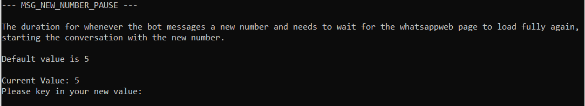


## Auto Save Frequency - Console Settings
The interval (in seconds) that the bot saves all the pending commands automatically. 
<br/>
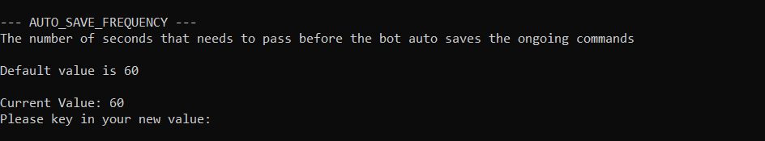


## Save when a command is complete - Console Settings
Tells the bot to whether to save when a command is executed. Set the value to "1" to represent "True" or "0" to represent "False"
<br/>
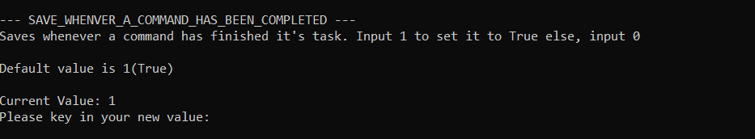


## Admin Numbers - Console Settings
The list that lets the bot recognise users with admin privileges. Admin users can access more features on the bot. 
```
Set the new value by typing the phone numbers or contact name (separated by ',')
Example:
- +6591234567, +6597654321
- Dad,Mum (Contacts need to be named the same as the input value on the phone the bot is using)
```

<br/>
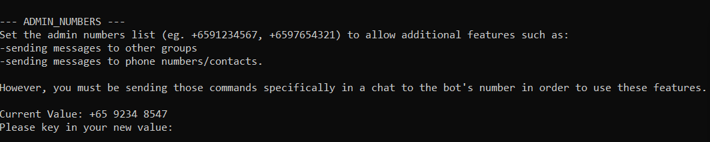


## Auto Remove Tries - Console Settings
The number of attempts the bot will carry through to execute a command before the command is automatically removed from its system.

<br/>
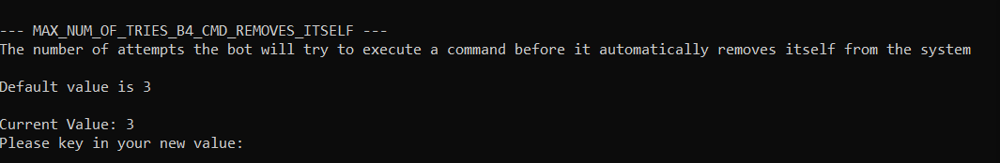


## Command Identifier - Console Settings
The symbol that identifies a message as a potential command to the bot. It is best to set it to a non-alphanumeric single character.

<br/>
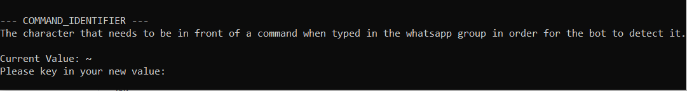


