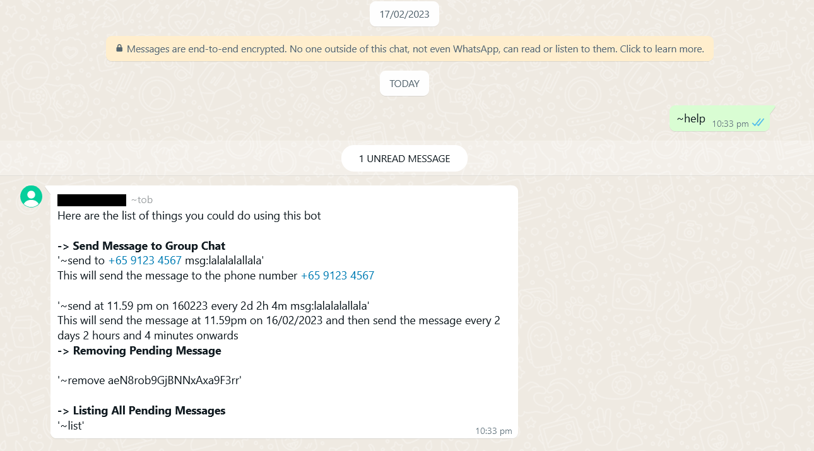

# Whatsapp Message Bot For Personal Use
 A whatsapp bot written in python to help send scheduled messages to a group or phone number.
 
# Content Table
- [Requirements](https://github.com/bestcolour/Python-Whatsappbot/edit/main/README.md#requirements)
- [How to setup](https://github.com/bestcolour/Python-Whatsappbot/edit/main/README.md#how-to-setup)
- [How to use bot (Whatsapp)](https://github.com/bestcolour/Python-Whatsappbot/edit/main/README.md#interact-through-whatsapp)
- [How to use bot (Console)]

 
# Requirements
- Firefox browser installed on the device you are going to let the bot run on
- A phone number with a Whatsapp account 


# How to setup
1. Download the 'build.zip' file from the release [page](https://github.com/bestcolour/Python-Whatsappbot/releases/tag/future-unknown-release)
<br/>

<br/>
2. Extract the files and go to dist > main > main.exe and open the exe, feel free to create a shortcut for this.
<br/>

<br/>
3. Once opened, you will see a console pop up. Give it a few seconds to open whatsapp web on the Firefox browser.
<br/>

<br/>
4. Scan the QR code on your phone tied to your whatsapp account.
<br/>

<br/>
5. Wait for the whatsapp web to finish loading before pressing "Enter" on the console
<br/>


<br/>
<br/>
<br/>

# How to use the bot

There will be two ways to interact with the bot. 
- Through the whatsapp group that the bot's number is in.
- Through the console that was opened when you clicked on main.exe

# Interact through Whatsapp
Now, to interact with the bot, you must first add it's number into a group chat of yours.
Once added, type '~help' to see a list of commands that the bot can perform.
<br/>


<br/>
<br/>

# Send Command
To use the send command, simply type '~send' and 'msg:<your message here>'. This will send a message to the current groupchat the bot is in.
<br/>


## Keywords
The command consists of keywords. By adding keywords, you could use to change the way a message is sent.
<br/> 
<br/> 
For example, let's say you want a message to be sent to remind the group chat that at 10pm tomorrow, you could type:
```
~send at 10pm 28/2/23 msg:Let's play dota now
```
or
```
~send 280223 at 10pm  msg:Let's play dota now
```
<br/> 
Keywords are interchangeable in position except for '~send' and 'msg:'. They must be at the front and end respectively.

### "at" keyword
"at" tells the bot what time to send the message.


```
at <time>

For example:
at 11.30pm
at 2359
at 8am

If "at" is not used, the time will be set to the current time
```
<br/>
<br/>
### "on" keyword
The "on" keyword tells the bot which date to send the message on.


```
on <date>

For example:
on 11/11/2023
on 11/11/23
on 111123

If "on" is not used, the date will be set to the current day
```
<br/>
<br/>
### "every" keyword
The "every" keyword is used to tell the bot to repeatedly send the message at a fixed interval.

```
every <interval>

For example:
every 1m (every 1 minute)
every 1h (every 1 hour)
every 1d (every 1 day)
every 1m 1h (every 1 minute and 1 hr)
every 1m 1h 1d (every 1 minute 1 hr and 1 day)

If "every" is not used then there will be not repeated sending of message
```


